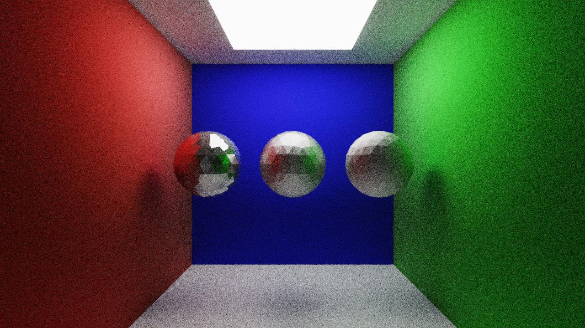

# Python CPU Path Tracer

Created by Norman Chen.

This is a CPU-based path tracer written in Python. It loads triangulated Wavefront `.obj` scenes, renders them with a basic physically based rendering workflow, and can save both noisy and denoised output images.

## Project Reflection

[docs/personal_reflection.md](docs/personal_reflection.md)

## Features

- NumPy-based vector math and optimizations
- Moller-Trumbore ray-triangle intersection
- Basic PBR workflow with metalness and roughness
- Wavefront `.obj` and `.mtl` scene loading
- Numba `njit` and `jitclass` compilation
- CPU multithreading with Numba parallelization
- Intel Open Image Denoise support through `pyoidn`
- Pygame render preview and comparison view for noisy and denoised renders

## Requirements

- Python 3
- A CPU supported by Numba
- Hardware supported by Intel Open Image Denoise if denoising is enabled

Install the Python dependencies from the project root:

```bash
pip install -r requirements.txt
```

## How To Run

1. Put your `.obj` and matching `.mtl` files in the `obj_files/` folder.
2. Make sure the model is triangulated. Non-triangular faces are not supported.
3. Edit render, camera, and output settings in `src/settings.py`.
4. Run the project from the repository root:

```bash
python -m src.run
```

The program will ask whether you want to render the scene or compare saved images:

- Type `render` to render the scene, save images, and open the viewer.
- Type `compare` to open the comparison viewer for existing saved images.

Rendered images are saved in `saved_images/`:

- `original_render.png`
- `denoised_render.png`

## Important Settings

Most user-facing settings are in `src/settings.py`:

- `screen_dimensions`: output resolution
- `camera_fov`: camera field of view in degrees
- `camera_world_pos`: camera position as `(x, y, z)`
- `camera_rotation`: camera rotation as `(pitch, yaw, roll)`
- `exposure`: brightness multiplier
- `background_color`: RGB background color using values from `0` to `1`
- `ray_samples`: rays per pixel for each accumulation pass
- `accumulation_samples`: number of accumulation passes
- `bounces`: maximum ray bounces
- `denoise`: whether to denoise while rendering chunks
- `comparison_slider`: whether to compare noisy and denoised images after rendering

Higher resolution, more samples, and more bounces improve image quality but increase render time.

## Important Considerations

Please do not expect a perfect path tracer. There may still be lighting bugs, but the renderer should work correctly for simple supported scenes.

The renderer has several limitations. It currently supports `.obj` geometry, `.mtl` material data, manual camera positioning, and one emissive material workflow. It does not currently support texture maps, transparency, displacement, smooth shading with vertex normals, irradiance caching, skyboxes, or GPU rendering.

Performance depends heavily on CPU speed, CPU thread count, image resolution, sample count, bounce count, and scene complexity. More objects, triangles, and materials will reduce performance.

Image quality depends on resolution, samples, bounces, and scene layout. Enclosed scenes usually converge better because rays are less likely to escape into the background.

## Hardware Requirements

Intel Open Image Denoise hardware requirements can be found at:
https://www.openimagedenoise.org/

Numba hardware requirements can be found at:
https://numba.pydata.org/numba-doc/dev/user/installing.html

## Possible Future Implementations

- Better folder structure management
- Settings GUI
- Correct light sampling
- Texture support
- Smooth shading using vertex normals
- GPU parallelization
- Transparent and translucent materials
- Irradiance caching
- Depth of field and blur control
- Skyboxes
- Ray marching
- Bounding Volume Hierarchy (BVH)
- More Pygame window customization, such as resizable windows and GUI controls

## References

- https://learnopengl.com/Advanced-Lighting/Gamma-Correction
- https://tavianator.com/2022/ray_box_boundary.html
- https://www.scratchapixel.com/lessons/3d-basic-rendering/ray-tracing-rendering-a-triangle/barycentric-coordinates.html
- https://www.scratchapixel.com/lessons/3d-basic-rendering/ray-tracing-rendering-a-triangle/moller-trumbore-ray-triangle-intersection.html
- https://www.youtube.com/watch?v=Qz0KTGYJtUk
- https://learnopengl.com/PBR/Lighting
- https://www.bluebill.net/2021/vector_reflection.html
- https://graphicscompendium.com/raytracing/11-fresnel-beer
- https://pema.dev/obsidian/math/light-transport/cosine-weighted-sampling.html
- https://en.wikipedia.org/wiki/Wavefront_.obj_file
- https://docs.blender.org/manual/en/latest/render/shader_nodes/shader/principled.html
- https://knarkowicz.wordpress.com/2016/01/06/aces-filmic-tone-mapping-curve/
- https://en.wikipedia.org/wiki/Cross_product#Geometric_meaning
- https://gabrielgambetta.com/computer-graphics-from-scratch/02-basic-raytracing.html

## Example Render



